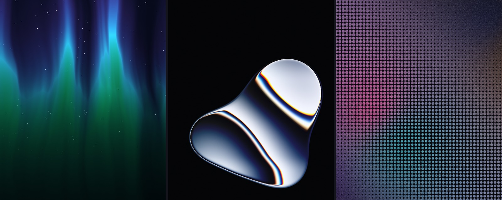
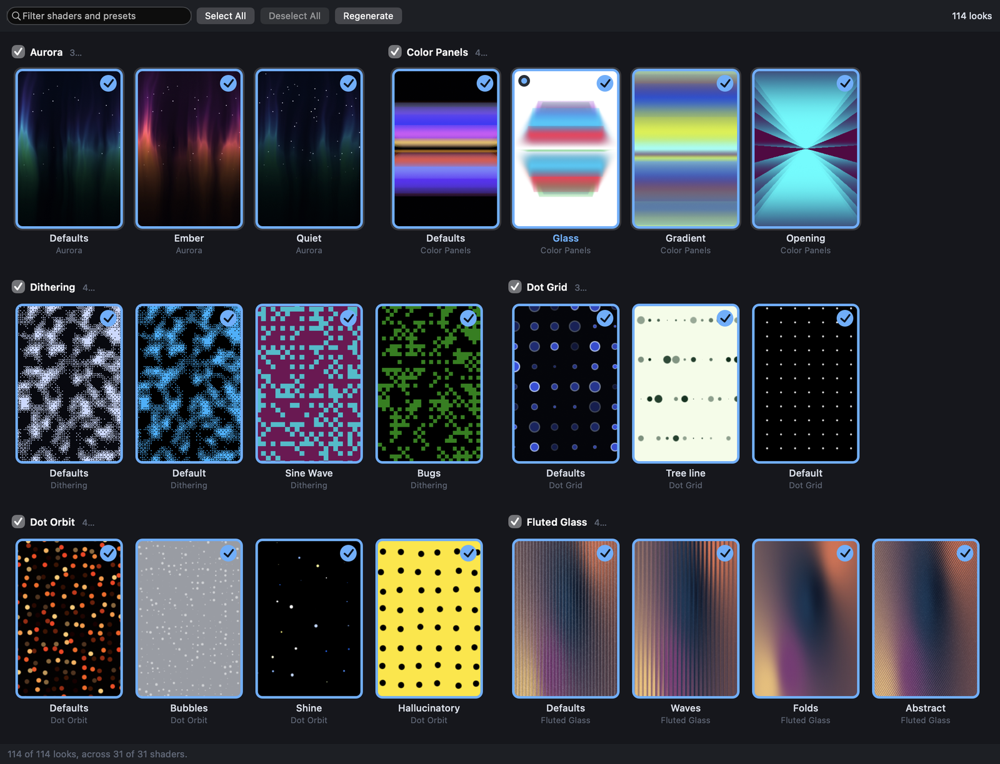
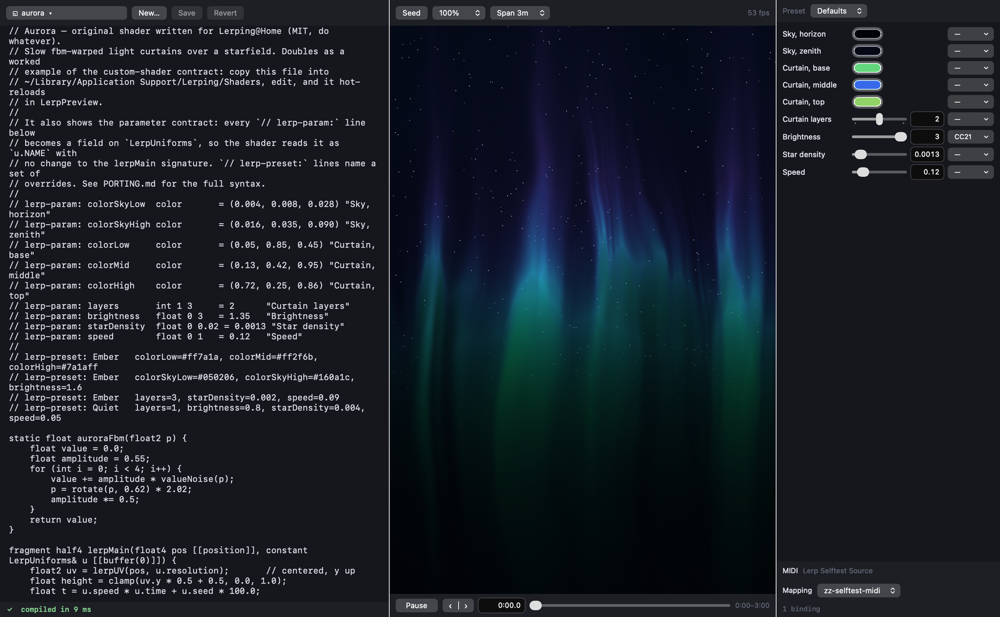

# Lerping@Home



- Screensaver for macOS that renders procedural shaders with Metal.
- Shaders are single `.metal` files compiled at runtime via `MTLDevice.makeLibrary(source:)`.
- 31 built-in shaders: aurora, color-panels, dithering, dot-grid, dot-orbit, fluted-glass, game-of-life, gem-smoke, god-rays, grain-gradient, halftone-cmyk, halftone-dots, heatmap, liquid-metal, mesh-gradient, metaballs, neuro-noise, paper-texture, perlin-noise, pipes, pulsing-border, simplex-noise, smoke-ring, spiral, static-mesh-gradient, static-radial-gradient, swirl, voronoi, warp, water, waves.
- Custom `.metal` files are supported without rebuilding the engine.
- No Xcode project. Builds with `swiftc` through a Makefile.
- No build-time Metal toolchain and no precompiled shader archive.

## Requirements

- Installation: macOS 14 or later on Apple Silicon.
- Building from source: Xcode command-line tools (`swiftc`).

## Install

Download and open the release DMG, then double-click **Install Lerping@Home**.
The standard macOS Installer opens. The screen saver is required. The Shader
Playground is selected by default, and you can clear its checkbox. Installer
puts the components in these locations:

```text
/Library/Screen Savers/Lerping@Home.saver
/Applications/LerpPlayground.app                 # optional
```

The packaged playground includes the built-in shader sources. It does not need
a source checkout. When you save a built-in shader, the app writes a personal
override to `~/Library/Application Support/Lerping/Shaders`.

To build and install from a checkout, use these commands:

```sh
make saver                 # build, install, verify, and stop stale saver hosts
make playground            # build, install, restart, and open the checkout editor
```

These commands deploy what this Mac runs. Use `make saver-build` or
`make playground-build` for a compile-only build. `make install` and
`make install-playground` are deployment aliases.

### Screen saver



- Select **Lerping@Home** in System Settings → Screen Saver.
- First activation can show black briefly while Gatekeeper verifies the bundle.
- Shader, preset, frame rate, and render scale are set behind the saver's Options…
  button. Pinning a shader also lets you pin one of its presets.
- Options… also has an **In rotation** gallery: pick which *looks* Shuffle draws
  from, by looking at them. Shuffle rotates over (shader, preset) pairs, not just
  shaders — defaults plus each distinct `// lerp-preset:` look, with a useful
  preset name replacing an identical “Defaults” tile. That is 123 looks across
  the 31 shaders rather than 31. Every look is a portrait still of itself; click
  a tile to put it in or take it out. They are grouped under a shader heading
  whose checkbox turns the
  whole group on or off and carries an *n/m* count, and there is a search field,
  Select All / Deselect All (which act on what the search is showing), and a
  status line. New shaders and newly added presets join the rotation
  automatically; selecting nothing means all.
- Pointing at a tile plays it, starting at the still's own time rather than
  t=0, so the first live frame matches the still already on screen. One shared
  `LerpMetalView` is reparented into the hovered tile; there is no per-tile
  renderer. Installing it is debounced, so sweeping across the grid compiles one
  pipeline. Scrolling, leaving the tile, and the window losing key each stop it.
  Resuming at the still's time is possible because a frame is a pure function of
  (shader source, parameters, time, seed) — the same property the on-disk still
  cache rests on. See `Sources/LerpCore/RotationPreview.swift`.
- The stills are rendered into the bundle by `make saver`, so opening Options…
  does no GPU work: the sheet is built in about 120 ms and the pictures are on
  screen a tenth of a second later. That matters because the sheet is built
  inside `legacyScreenSaver`, which is App Sandboxed — see "What the sandbox
  allows" below. Anything the bundle does not have a still for (a custom shader,
  a shader edited since the build) is rendered on the spot, in parallel, into a
  cache inside the sandbox container. Nothing ever blocks the sheet.
- The same gallery is a window of its own in the playground
  (**Shader → Screensaver Rotation…**, ⌥⌘R), where clicking a tile writes the
  screensaver's rotation immediately and **double-clicking one opens it in the
  editor**, preset and all. It is one implementation, in
  `Sources/LerpCore/RotationGallery.swift` — and the same tile is what the
  playground's toolbar picker is made of, with its primary action inverted. See
  "Shader playground".
- Options… has a **Set desktop picture to the last frame** checkbox, off by default.
  See "Desktop picture handoff" below.

### Playground

Optional, and only for the shader editor described under "Shader playground"
below — the saver does not need it.

The following details apply to a playground built from a source checkout:

- `make install-playground` copies `build/LerpPlayground.staging.app` to
  `~/Applications/LerpPlayground.app`, signs it again and registers it, so typing
  "lerp" into Spotlight offers it. `/Applications`, `/System/Applications` and
  `~/Applications` are the only places Spotlight's Applications category draws
  from; the bundle in `build/` is indexed and `open -a` finds it, but Spotlight
  will not offer it.
- A copy, not a symlink. Spotlight resolves symlinks and indexes the app at its
  real path, so a link in `~/Applications` leaves it exactly as unfindable.
- The installed copy edits the checkout it was installed from, recorded as
  `LerpRepoRoot` in its own `Info.plist` — it cannot walk up to one the way the
  in-repo build does, because nothing above `~/Applications` is a checkout.
  Re-run the target to re-point it.
- That path is the **main working tree**, not `$PWD`: installing from a git
  worktree records the checkout the worktree belongs to, because the worktree
  itself is deleted when its branch is done and an app pointed at it would break
  the moment it was. Override it, or install from outside a git repo, with:

```sh
make install-playground PLAYGROUND_REPO=/path/to/lerping-at-home
```

- Either way the target checks before it copies anything: a `PLAYGROUND_REPO`
  with no `Sources/Shaders` in it stops the install and says so, rather than
  baking in a path that does not work.

- If that checkout later moves, the app says so at launch — by name, with the
  path that is gone — and offers a folder picker. It never opens onto an empty
  shader list. What you pick is remembered;
  `defaults delete com.hergenroeder.lerping.playground.installed LerpRepoRoot`
  forgets it, and `LERP_REPO_ROOT=/some/checkout` overrides it for one launch.
- `LerpPlayground --shaders` prints which checkout a copy resolved, how it got
  there, and what it found, and exits non-zero if it found nothing.
  `make install-playground` runs it against the copy it just installed, so the
  target fails if the install cannot see your shaders.
- `build/LerpPlayground.staging.app` is staging only and is never registered or opened
  by a normal target. `make playground` always runs the canonical copy in
  `~/Applications`.
- Deployment asks the running canonical app to quit through its normal Save /
  Discard / Cancel path and waits for a real exit before replacing it. Cancel
  aborts deployment. A pre-migration build is refused until it is closed once,
  because it cannot prove that unsaved editor text is protected.
- `make uninstall-playground` removes the canonical copy. `make clean` removes
  staging only.

### Build a release image

`make dmg RELEASE_VERSION=0.1.0` creates an unsigned DMG for local inspection.
It does not install either component. The DMG contains the component installer,
which keeps the optional Playground checkbox. The output is
`build/release/LerpingAtHome-0.1.0-arm64.dmg`.

`make package RELEASE_VERSION=0.1.0` builds only the inner PKG when you need to
inspect Installer choices.

A public DMG needs Developer ID Application and Developer ID Installer
certificates, plus a `notarytool` keychain profile. Build and notarize it with:

```sh
make release RELEASE_VERSION=0.1.0 \
  APP_SIGN_IDENTITY="Developer ID Application: YOUR NAME (TEAMID)" \
  INSTALLER_SIGN_IDENTITY="Developer ID Installer: YOUR NAME (TEAMID)" \
  NOTARY_PROFILE=lerping-notary
```

The target signs both bundles and the inner PKG, notarizes and staples the PKG,
then signs, notarizes, staples, and checks the final DMG. It writes a SHA-256
file beside the DMG. Publish the DMG and checksum in a tagged GitHub Release.

## Live shader development

```sh
make preview && ./build/LerpPreview
```

- `←` / `→` — switch shader.
- `space` — pause.
- `r` — recompile current shader.
- `q` — quit.
- `./build/LerpPreview --list` — print discovered shaders.
- `./build/LerpPreview --snapshot out/` — render every shader to PNG.
  - Flags: `--size WxH`, `--time T`, `--seed S`, `--shader name`.
  - Exits non-zero if a shader does not compile.

## Shader playground

```sh
make playground
```



- Builds a staging bundle, deploys it to `~/Applications/LerpPlayground.app`,
  gracefully replaces any running older copy, and opens that canonical app.
  The installed bundle has a Dock tile, a ⌘-Tab entry and an app menu, and
  `open -a LerpPlayground` resolves to it.
- **One installed app, one process.** Running `make playground`, `open -a`, or
  using the Dock raises the canonical copy instead of launching staging.
- Closing the window quits the app; unsaved edits get Save / Discard / Cancel.
- The installed app edits the checkout recorded during deployment, so `open`'s
  working directory does not matter. See "Install" above.
- Split window: `.metal` source on the left, live render on the right.
- **What it opens on.** The look you last had open, if it is still on disk and
  still compiles — closing the window mid-shader and coming back to a different
  one loses your place, and nothing is worth that. Failing that (a first launch,
  a deleted shader, one that no longer builds) it draws a look at random from the
  looks your *screensaver* shuffles through, preset and all, so it opens on
  something you actually chose rather than on whatever sorts first. It reads that
  rotation and never writes it; the last-opened look is remembered in the app's
  own preferences, not the screensaver's.
  - The rotation is taken literally, an empty one included; what stops the
    playground opening onto nothing is its own fallback to the first look on
    disk, not a widening of the rotation. A look that will not compile is
    stepped past rather than opened.
- Uses the same LerpCore compile path as the screensaver.
- Editing recompiles 300 ms after the last keystroke and swaps the pipeline in place.
- On a compile error the last successful pipeline keeps rendering; the view does not blank and the process does not exit.
- Compile errors are listed in a console below the editor as `line:column`; the offending lines are highlighted, and `⌘E` (or clicking the status bar) jumps to the first one.
- Metal's reported line numbers match the shader file, because the prelude ends with `#line 1`.
- The shader picker is a popover of tiles, not a text dropdown. Opened from the
  toolbar button, `⌘O`, or **Shader → Open Look…**, built from the same tile as
  the rotation gallery, over `Sources/Shaders/` plus the custom shader
  directory, refreshed when files change on disk. It lists all 123 looks; the
  previous text dropdown listed 31 shader names.
  - The two surfaces invert each other. In the gallery, a click toggles the look
    in or out of the rotation and a double-click opens it. In the popover, a
    click opens it and the corner badge toggles the rotation.
  - A look that is out of the rotation is drawn dimmed and opens on the same
    click as any other.
  - The popover opens with the caret in a filter field; typing filters, and ⏎
    opens the first look still showing.
  - The grid leads with a dashed **+** card, "New Shader…" — the same scaffold
    `⌘N` runs, in the grid you are already reading when the look you wanted turns
    out not to exist. It is not a look: it is in no count, no rotation and no
    filter, and `‹` `›` step straight past it. It appears only in the popover,
    the one surface that can open what it makes, so the toolbar no longer carries
    a New… button.
  - Pointing at a tile plays it, as in the gallery — it is the same tile.
  - Both grids mark the look the editor has open and share one cache of stills,
    so opening the popover after the gallery renders nothing new.
  - `‹` and `›` sit beside the button: one **look** back or forward through the
    same list the popover shows — all 123, presets included, in the same order —
    wrapping at both ends and loaded the way a click in the popover loads it.
    They are `⇧⌘[` / `⇧⌘]` as buttons (**Shader → Next Look** / **Previous
    Look**). Stepping over a shader's presets rather than over shader names is
    the point: the presets of one shader are what you want to flip between to
    compare, and they are the entries a walk over names skips. Landing on the
    look already open does nothing rather than re-opening it.
- The rotation gallery window opens from **Shader → Screensaver Rotation…**
  (`⌥⌘R`). The toolbar has no button for it. It holds Select All, Deselect All,
  and a wider grid than the popover.
- **Save** (`⌘S`) overwrites the look that is open, and never asks anything. The
  window changes two things — the text and the values — and both live in the same
  `.metal` file, so one command writes both: with a preset on, the values go back
  into that preset's own `// lerp-preset:` block; with none on, into the
  `// lerp-param:` lines' `= DEFAULT`, which is where the Defaults look keeps its
  values. Naming a look that does not exist yet is Save As, and Save As is `⇧⌘S`.
  - Only the `= DEFAULT` token of a declaration moves. The name, type, range,
    label and the column the label sits in are left exactly as they were typed.
  - Saving the defaults moves every preset that stays silent about that
    parameter, because a preset records only what differs from them. That is what
    editing the declaration by hand does too, and it is the only thing saving the
    Defaults look can honestly mean; the status line says how many lines moved,
    and `⌘Z` takes the buffer back.
  - A buffer that does not compile still saves its text. An editor that refuses
    your typing because the shader is mid-edit is an editor with a bug in it —
    it is the *values* that wait for a compile, and the console says why.
  - Save and Revert light up for a moved slider exactly as they do for a
    keystroke, and Revert puts both halves back. Only the text raises the
    close-the-window prompt: switching looks is how this window is browsed, and a
    question on every step of it would be unusable.
- **Shader → Save Look as Preset…** (`⇧⌘S`) writes the values on screen back into
  the shader as a named `// lerp-preset:` block. A new name adds a look;
  entering an existing name replaces it after confirmation. The look gets a tile
  in the picker and gallery straight away, joins the screensaver's rotation, and
  the editor ends up wearing it. The toolbar has no button for it either.
  - Only parameters that differ from the shader's declared defaults are written,
    because a preset is an overlay and a line restating a default freezes today's
    value into a file whose author may move it tomorrow.
  - New blocks are appended after the file's existing presets. Replacements stay
    in their existing position, so the saved rotation keeps the same entry and
    enabled/disabled choice.
  - Values are spelled so that re-parsing the file yields the same uniform block
    the GPU was being handed: hex for colours that sit on an 8-bit step, and
    otherwise the shortest decimal that survives a `float` round trip. Dragging a
    slider and saving gives back the picture you were looking at, not one six
    significant digits away from it.
  - It saves the file, unsaved edits included, and says so in the prompt before
    it does: a preset can only name parameters the file itself declares, so the
    block and the edits that justify it are one change. A buffer that does not
    compile is refused — what is on screen then is the last version that did.
  - Preset names are matched without regard to case. Empty names, names with a
    double quote or tab, and `Defaults` are still refused, because `Defaults` is what every
    shader's un-preset look is already called.
- An externally modified open file reloads if there are no unsaved edits.
- Time scrubber, render scale (100/75/50/25%), and fps readout map onto `LerpUniforms` and `LerpMetalView.Config`.
- Editor is a plain `NSTextView` with soft tabs, auto-indent, undo, and find. No syntax highlighting and no line-number gutter.

Keys:

- `⌘O` — open the shader picker; type to filter, ⏎ opens the first match.
- `⌘N` — scaffold a new starter shader into `Sources/Shaders/`, as the picker's
  **+** card does.
- `⌘S` — save the `.metal` file: the text, and the look on screen back into the
  preset (or the declared defaults) it came from.
- `⇧⌘S` — Save As: the look on screen under a name, as a new preset or over an
  existing one.
- `⌘R` — recompile.
- `⌘\` — play/pause.
- `⇧⌘R` — re-roll seed.
- `⌥⌘R` — open the screensaver rotation gallery window.
- `⇧⌘[` / `⇧⌘]` — previous/next look.

Other targets:

- `make package RELEASE_VERSION=…` — build the inner Installer package for inspection.
- `make dmg RELEASE_VERSION=…` — wrap that installer in the unsigned release DMG.
- `make release RELEASE_VERSION=…` — sign, notarize, staple, and check the public DMG.
- `make playground-build` — compile-only staging at
  `build/LerpPlayground.staging.app`; it is not registered or launched.
- `make saver-build` — compile-only staging at `build/Lerping@Home.saver`.
- `make install-playground` deploys the canonical Spotlight copy without opening
  it; `make uninstall-playground` gracefully stops and removes it.
- `build/LerpPlayground.staging.app/Contents/MacOS/LerpPlayground --shaders` — print the checkout this copy reads, how it resolved it, and the shaders in it. Exits non-zero if there are none.
- `build/LerpPlayground.staging.app/Contents/MacOS/LerpPlayground --capture out.png` — build the real window the way a launch does, say what it opened on and whether that came from the memory or from a draw against your rotation, and write a PNG of it. Reads your screensaver settings, writes none of them, and puts the last-opened memory back as it found it. The render pane is empty in the PNG: it is a `CAMetalLayer`, which `cacheDisplay` cannot reach.

## Custom shaders

- Custom shader directory: `~/Library/Application Support/Lerping/Shaders/`.
- `LerpPreview` reads that directory at runtime; edit a file and press `r` to recompile.
- The installed screen saver reads this directory at runtime. A custom shader can replace a built-in shader with the same filename stem.
- The packaged playground saves built-in edits here because it cannot modify its signed app bundle.
- `make saver` also copies this directory into a locally built `.saver`. This gives every custom look a bundled gallery still and stops stale saver hosts.
- `make install-example` copies the plasma template into the custom shader directory.

```sh
cp myshader.metal ~/Library/Application\ Support/Lerping/Shaders/
./build/LerpPreview          # iterate without reinstalling
make saver                   # build, deploy, and retire stale saver hosts
```

### Shader contract

- One fragment function per file, with this exact signature:

```metal
fragment half4 lerpMain(float4 pos [[position]], constant LerpUniforms& u [[buffer(0)]]) {
    float2 uv = lerpUV(pos, u.resolution);   // [-1,1] short axis, y up
    float3 color = float3(0.5 + 0.5 * sin(u.time + uv.xyx));
    return half4(half3(color), 1.0h);
}
```

- Uniforms: `u.resolution` (pixels), `u.time` (seconds), `u.seed` (random per launch, `[0,1)`).
- Prelude helpers: `lerpUV`, `lerpScreenUV`, `rotate`, `hash11/21/22`, `valueNoise`, `snoise` (simplex), `glmod/2/3`, `lerpDither`, `PI`, `TWO_PI`.
- The prelude is prepended to every shader before compilation. Source: `Sources/LerpCore/Prelude.swift`.
- Prelude symbols must not be redefined in a shader file.
- Worked example with comments: `Templates/plasma.metal`.
- Porting reference: `PORTING.md`.

### Shader parameters and presets

Tunable values are declared in the `.metal` file itself, so a shader carries
its parameters and presets wherever the file goes.

```metal
// lerp-param: distortion float 0 1 = 0.8 "Distortion"
// lerp-param: octaves    int 1 8   = 4   "Octaves"
// lerp-param: mirrored   bool      = false
// lerp-param: colorBack  color     = #06111C "Background"
//
// lerp-preset: Lagoon     distortion=0.8, colorBack=#06111C
// lerp-preset: "Deep Sea" distortion=0.2, octaves=6
```

- Syntax: `// lerp-param: NAME TYPE [MIN MAX] = DEFAULT ["Label"]`. Types are
  `float`, `int`, `bool`, `color`; MIN/MAX are required for `float`/`int` only.
  Colour defaults take `#RGB`, `#RRGGBB`, `#RRGGBBAA` or `(r, g, b[, a])`.
- Declared parameters become extra fields on `LerpUniforms`, so the shader
  reads them as `u.distortion`, `u.colorBack` — the `lerpMain` signature and
  the buffer bindings are unchanged, and a shader with no parameters compiles
  and renders exactly as before.
- `// lerp-preset: NAME  key=value, …` names a set of overrides; quote names
  with spaces, and repeat the name on later lines to split a long preset. A
  preset is an *overlay*: anything it does not name keeps the declared default,
  and follows it if the default later changes.
- The playground writes this form for you — **Shader → Save Look as Preset…**
  turns the values on screen into a new named block in the file. See "Shader
  playground".
- A malformed declaration is a compile error naming the line.
- 28 of the 31 built-in shaders declare parameters mirroring the upstream
  paper-design props, with defaults set to this project's current look and the
  upstream looks available as presets.
- Inspect and drive them from the CLI:

```sh
./build/LerpPreview --params swirl                                   # declarations + presets
./build/LerpPreview --snapshot build/x --shader swirl --preset Candy
./build/LerpPreview --snapshot build/x --shader swirl --param twist=0.6
```

- The playground shows controls for all declared parameters. The screen saver
  can select named presets, but it does not store arbitrary control values.
  Use **Shader → Save Look as Preset…** to make a tuned look available to it.
  Details and porting guidance: `PORTING.md`.

### Shaders with CPU-computed data

- A shader that needs more than the 16-byte uniform block — a table, a segment
  list, an occupancy grid — declares a data provider with a comment on one of
  its first lines: `// lerp-data: pipes`.
- The provider computes that data on the CPU each frame and binds it at
  fragment buffer index 1 and up; index 0 stays `LerpUniforms`.
- It also supplies the MSL struct declarations the shader reads it with, spliced
  into the prelude ahead of `#line 1` so error line numbers still match the file.
- A provider must *derive* its data from `(time, seed)` every frame, never
  accumulate across frames — a rendered frame is a pure function of
  (shader, time, seed, parameters), which is what makes `--snapshot --time T`
  reproducible.
- A provider that also needs the shader's `// lerp-param:` values — `life` is
  sized by `size` and stepped at `speed` — implements the `params` overload of
  `bind`. It defaults to the two-argument form, so providers that ignore
  parameters are unaffected.
- **Iterative simulations** are the one thing that cannot be derived in closed
  form, and `life` is the pattern for them: bound the history instead of
  abandoning purity. Each of its ten cellular-automaton stories has an epoch
  sized to its own arc, so reaching *any* t costs at most that one story. Dense
  full-screen soups use toroidal arrays; canonical patterns use sparse,
  dead-edged boards, letting the R-pentomino complete all 1,103 generations
  cheaply. Its shader interpolates the binary board into a continuous organism
  field with membrane lighting, birth pulses, and death glow; the underlying
  automaton remains exact. The cached board's key is its whole input, so
  stepping it forward lands on the bytes a cold rebuild would produce.
- `heatmap`, `life` and `pipes` use one. Every other shader keeps the plain
  `fragment half4 lerpMain(float4, constant LerpUniforms&)` signature.
- Protocol and registry: `Sources/LerpCore/DataProvider.swift`. Worked examples:
  `Sources/LerpCore/PipesData.swift` (derive every frame),
  `Sources/LerpCore/LifeData.swift` (bounded history). Details in `PORTING.md`.

### GLSL → Metal mapping

| GLSL | Metal |
|---|---|
| `vec2` / `vec3` / `vec4` | `float2` / `float3` / `float4` |
| `mat2(a,b,c,d)` | `float2x2(float2(a,b), float2(c,d))` |
| `atan(y,x)` | `atan2(y,x)` |
| `inversesqrt` | `rsqrt` |
| `mod` | `glmod` (not `fmod`; results differ for negatives) |
| `gl_FragCoord` | `pos` |

## Layout

```
Sources/LerpCore/     shared engine, no ScreenSaver dependency
  Prelude.swift        Metal prelude prepended to every shader at runtime
  ShaderLibrary.swift  shader discovery (bundle + custom dirs) + runtime compilation
  ShaderParameters.swift  `// lerp-param:` / `// lerp-preset:` parsing, layout and packing
  DataProvider.swift   optional per-frame CPU→GPU data for shaders that need it
  PipesData.swift      data provider for pipes: deterministic lattice walk
  LerpRenderer.swift   stateless fullscreen-triangle pass encoder
  LerpMetalView.swift  CAMetalLayer view: CADisplayLink, fps cap, occlusion pause
  Snapshot.swift       offscreen render to PNG
Sources/Shaders/     built-in shaders, shipped as bundle Resources
Sources/Saver/       ScreenSaverView shim + Info.plist
Sources/Preview/     LerpPreview dev app / snapshot CLI
Sources/Playground/  LerpPlayground editor + live render, hot reload
  Info.plist           the .app's identity: bundle id, name, icon
Packaging/          Installer choices, copy, and safe-update script
Templates/          example shader
```

`LerpCore` holds the rotation gallery (`RotationGallery.swift`,
`RotationThumbnails.swift`, `RotationPreview.swift`) and the colours and control
helpers it draws with (`UIChrome.swift`) because it has three hosts that cannot
see each other's sources: the screensaver's Options… sheet, the playground's
rotation window, and the playground's toolbar picker popover. What stays in
`Sources/Playground/` is the part that is the playground's alone —
`RotationWindow.swift` and `ShaderPicker.swift`, the two surfaces, and
`RotationStore.swift`, which writes the screensaver's ByHost domain the moment
you click. `RotationStore` is
*not* hoisted: it needs `-framework ScreenSaver`, and neither the preview app nor
the snapshot renderer should have to link a framework they never use.

## Runtime behavior

- Frame rate is capped at 30 fps by default via `CADisplayLink.preferredFrameRateRange`.
- Frame rate drops to 0 fps when the window is occluded — but only where AppKit actually
  reports occlusion. It does not for a `legacyScreenSaver` host at the desktop-wallpaper
  layer, which is why the saver has a second, independent check; see below.
- Low Power Mode caps the frame rate at 20 fps.
- Internal render scale is selectable at 100%, 75%, or 50%; the compositor upscales.
- The animation clock is frozen while paused, so time does not jump on resume.
- "Still image" (default: after 30 minutes) stops rendering and holds the last frame.

## legacyScreenSaver behavior handled in `Sources/Saver/`

- The system does not destroy saver instances, and never reports occlusion for a host parked at the desktop-wallpaper layer (`CGWindowLevel -2147483625`, full-screen bounds, `onscreen=false`). Neither of `LerpMetalView`'s own stop paths is reachable there, so such a host renders forever behind the desktop. Measured on macOS 27: **5.5% CPU sustained** (`ps -o time=` delta of 1.65 s over a 30 s window) with the screensaver not running.
- **The saver always draws on `startAnimation`.** Gating that on the start notifications produced a permanently black screensaver, twice: legacyScreenSaver spawns the host *after* `willstart`/`didstart` are broadcast, distributed notifications are not queued, and a fresh process therefore cannot ever see the start of its own session. A host only ever observes the stops.
- `stopAnimation` *is* called on macOS 27, ~400 ms after `didstop`. Both `startAnimation` and `stopAnimation` stay wired up; the stop notifications are what usually ends a session first.
- **Nothing about the host tells you which kind it is.** Measured, and each rules out an obvious fix:
  - Both kinds sit at window level `-2147483625`. So does WallpaperAgent's own window.
  - A host that is *visibly rendering the screensaver* has `kCGWindowIsOnscreen` **false** on its own window for the whole session — its layer is composited into a window belonging to WallpaperAgent and its own window is never ordered in. Sampled once a second from outside the process across two real activations, one of them 11 minutes long. `NSWindow.isVisible` and `occlusionState` follow the same window, which is also why occlusion notifications never arrive. Anything keyed on them blacks out the real screensaver.
- So the saver does not classify itself. It draws, and it drops to **one frame a second** only when it can prove nothing it draws can be on screen: every display asleep, the session not on the console, or somebody demonstrably working at the machine for five consecutive seconds (any input at all ends a screensaver, so that cannot be true of the host the user is looking at).
- Against those stands one piece of positive evidence that overrides all of them: `CAMetalDrawable.presentedTime`, i.e. a frame of ours that actually reached a display. Measured with this view's exact shape — 299 non-zero times out of 300 frames in a window that is on screen, 0 out of 300 in one that is not. It is evidence in one direction only; a visible layer that is composited rather than given a display plane can report zero too, so its absence proves nothing and is never read as proof.
- Parking is one frame a second rather than zero on purpose. A host parked by mistake is a slow screensaver for one second, not a black one, and the frame it draws each second is what re-tests the verdict. Measured on a full-screen 1512×982 hidden host: **1.42% CPU rendering → 0.32% parked**, parked 8 s in.
- The host process is never terminated. `exit(0)` on `willstop` raced the lock-screen UI, which is why the lock screen was blank, animated, or static at random. A retained window with its backing store intact costs nothing and makes the lock screen deterministic — it shows the frame the saver stopped on.
- Consequence: after `willstop` the lock screen shows a **frozen** last frame, not animation. `willstop` is the system saying the session is over.
- A host never sees `willstart`/`didstart` for its own session, but a host that outlives one *does* see the next one's. That is what un-parks a host that parked itself in error. Hosts are reused: the same pid was observed serving two sessions, building a new window for each.
- legacyScreenSaver can construct **two** `LerpSaverView` instances per host, the second ~165 ms after the session has already started. Only one of them is ever put in a window; anything with a side effect (the wallpaper handoff) is gated on `window != nil`.
- The System Settings preview instance keeps the classic `startAnimation`/`stopAnimation` contract, ignores the distributed notifications and is never parked, so neither a real screensaver cycle nor a verdict can freeze or slow the thumbnail.
- `isPreview` is unreliable on macOS Tahoe, so a small frame size is also treated as preview.
- `animateOneFrame` is not used; the view drives its own display link.
- Lifecycle is logged to `com.hergenroeder.lerping` at `info` level; nothing about this path is debuggable without it:

```sh
log show --last 5m --info --style compact --predicate 'subsystem == "com.hergenroeder.lerping"'
```

## What the sandbox allows

`legacyScreenSaver.appex` — the process that hosts the saver *and* builds its
Options… sheet — carries `com.apple.security.app-sandbox`. Measured on macOS 27,
Apple M5, by ad-hoc signing a host with a transcription of legacyScreenSaver's
own entitlements and loading the real `.saver` into it:

| | |
|---|---|
| `NSHomeDirectory()` | `~/Library/Containers/<id>/Data` — a real container |
| `MTLCreateSystemDefaultDevice()` | yes |
| `device.makeLibrary(source:)` | yes, 1–43 ms for a trivial shader |
| write `<container>/Library/Caches/…` | yes |
| write `~/Library/Caches/…` | **denied** — "You don't have permission to save the file" |
| read `~/Library/Application Support/Lerping/Shaders` | yes — the appex holds a read-only exception for `/` |
| read its own `Contents/Resources/Thumbnails` | yes |
| build the real Options… sheet | 121 ms, 124 tiles (123 built-in + 1 custom) |
| fill it | 0.16 s — 123 stills off the bundle, 1 rendered |
| reopen it | 90 ms, entirely from memory |

So the sandbox can render, but it cannot cache anywhere the rest of the machine
can see — the stills are baked into the bundle by `make saver`
rather than shared with the playground's `~/Library/Caches` copy, and why
whatever the bundle is missing is cached in the container instead. The read-only
exception for `/` is also why a custom shader in
`~/Library/Application Support/Lerping/Shaders` shows up in the sheet's gallery
even before `make saver` bakes it into the bundle.

## Desktop picture handoff

- **Off by default.** Enable with **Set desktop picture to the last frame** in Options….
  Off by default.
- On `com.apple.screensaver.willstop` the saver reads the exact `shaderName`, `time` and
  `seed` the view is on, re-renders that frame offscreen at each display's native pixel
  size via `LerpSnapshot`, writes it to a new PNG, and calls `NSWorkspace.setDesktopImageURL`
  for each `NSScreen`.
- Effect: the desktop, the locked session, and the pre-login login window all show the frame
  the screensaver ended on. macOS propagates it — `wallpaperexportd` mirrors the desktop
  picture to `/var/db/Wallpapers/<uuid>/Wallpaper.png` and to the Preboot volume, which is
  what the pre-login window reads. Verified end to end on macOS 27.
- The export is downscaled to logical points (a 3024x1964 render comes back out as 1512x982),
  so rendering at native panel resolution is already more than enough.
- **Where the file goes:** `legacyScreenSaver` is sandboxed and writing to the real
  `~/Library/Application Support/Lerping/wallpaper/` is denied outright, exactly like the
  custom shader directory. The stills land in the sandbox container instead:

```
~/Library/Containers/com.apple.ScreenSaver.Engine.legacyScreenSaver/Data/
  Library/Application Support/Lerping/wallpaper/<shader>-<id>-<screen>.png
```

  `setDesktopImageURL` accepts that URL and `wallpaperexportd` mirrors it — verified. The
  consequence is that the desktop picture points into a sandbox container: if the container
  is ever reset, the wallpaper breaks until the next screensaver cycle.
- Every frame is written to a **new** filename. Rewriting the same URL does not refresh the
  desktop picture.
- `~/Library/Application Support/com.apple.wallpaper/Store/Index.plist` is never edited
  directly. `WallpaperAgent` holds an in-memory copy and flushes it back over any edit, and
  it lags the API call by seconds, so it is not a way to confirm anything either.
- Generated PNGs older than two minutes are deleted after each successful handoff. Age-based
  rather than "delete everything I did not just write", because with more than one display
  macOS can run more than one saver host and a strict keep-set lets one host delete a still
  another host just handed to the wallpaper agent.
- Multi-display: each `NSScreen` gets its own render at its own aspect ratio. The Preboot
  export is per **user** — one file — so the login window only ever shows the primary
  display's frame. That is a macOS limitation, not something this code can fix.

## Wallpaper mode

- Not implemented; the handoff above is a still image, not a live animated desktop.
- `LerpMetalView` has no ScreenSaver dependency and can be hosted elsewhere.
- Path: a menu-bar app placing one `LerpMetalView` per `NSScreen` in a borderless window at `kCGDesktopWindowLevel`, with `ignoresMouseEvents`, `.canJoinAllSpaces`, `.stationary`, and occlusion pausing.

## License

- AGPL-3.0-or-later. See `LICENSE`.
- Copyleft: derivative works and redistributed modified versions must also be released under AGPL-3.0.
- AGPL-3.0 adds section 13 to GPL-3.0: users interacting with a modified version over a network must be offered its source. This program does no network interaction, so section 13 is inert here.
- Apache-2.0 is one-way compatible with the GPL-3.0 family, so the combined work is conveyed under AGPL-3.0. Apache-2.0 is not compatible with GPL-2.0.
- `Sources/Shaders/aurora.metal` is original work, additionally offered under MIT in its file header.

## Sources

- [paper-design/shaders](https://github.com/paper-design/shaders) — Apache-2.0. 28 of the 31 shaders are ports of it; the prelude's hashes, value noise, simplex noise and banding fix derive from it. Per-shader attribution in `NOTICE.txt`.
- Neuro Noise — original GLSL algorithm by [@zozuar](https://github.com/zozuar), via Paper Shaders.
- Microsoft 3D Pipes (`sspipes`, Copyright (c) 1994-1995 Microsoft Corporation) — `Sources/Shaders/pipes.metal` is an original raymarched SDF sharing no code with it, and reuses its published numeric constants. See `NOTICE.txt`.
- The OpenGL "teapot" material table (emerald, jade, pearl, ruby, turquoise, brass, bronze, copper, gold, silver, plastics, rubbers) — long-published values used by `pipes`.
- [orchetect/swift-midi](https://github.com/orchetect/swift-midi) — MIT. MIDI I/O for the playground, linked statically via `Sources/MIDIDeps`. Formerly named MIDIKit.
- [MIKMIDI](https://github.com/mixedinkey-opensource/MIKMIDI) — MIT. The MIDI mapping model (per-device bindings, MIDI learn, named banks) follows its design. No MIKMIDI code is used and it is not a dependency.
